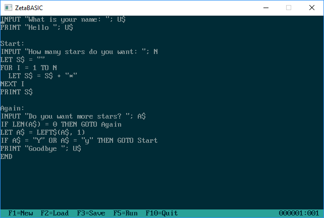

# ZetaBASIC

ZetaBASIC is a combination Integrated Development Environment (IDE) and interpreter for a BASIC-style language on the Windows, macOS and Linux platforms.

## Installation

ZetaBASIC comes with both a Visual Studio 2017 solution and a cross-platform Makefile. For building from the command-line (or Visual Studio), there are three environment variables that are expected to be defined:

* SDL_INC_PATH - Path to the SDL include files
* SDL_LIB_PATH - Path to the SDL library files
* SDL_LIBS - SDL (and any dependency) libraries

## License

This project is licensed under the BSD (3 clause) license - see the LICENSE.md file for details.
